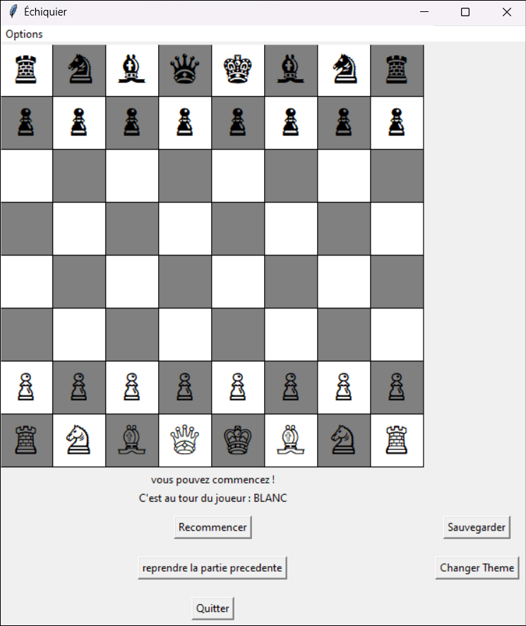

## Objectifs

- Familiarisation avec la programmation orientée objet.
- Utilisation de la structure de données "dictionnaire".
- Validation de la compréhension du cours de python.
- Promouvoir la décomposition fonctionnelle et la réutilisation de fonctions.

## Organisation du Travail

Bien que ce travail puisse être réalisé individuellement, il est recommandé de travailler en équipe pour partager la charge de travail et renforcer les compétences de collaboration.

## Apperçu:
<!--   -->

<table>
  <tr class="chess-images">
    <td>
      
    </td>
    <td>
      
    </td>
  </tr>
</table>

## Pièces et leurs Mouvements:
- **Pion**: Se déplace d'une case à la fois vers l'avant. Peut avancer de 2 cases depuis sa position initiale. Prend les adversaires en diagonale.
- **Tour**: Se déplace le long des rangées et des colonnes.
- **Fou**: Se déplace en diagonale.
- **Cavalier**: Se déplace en forme de "L".
- **Dame**: Combinaison des mouvements de la tour et du fou.
- **Roi**: Se déplace d'une case dans n'importe quelle direction.

## Fonctionnalités
- Déplacement des pièces selon les règles standard des échecs.
- Validation des mouvements.
- Changement de joueur après chaque tour.
- Détection de la fin de la partie.

## Technologies Utilisées
- Python
- tkinter (pour la partie graphique)

## Conclusion
Ce projet a permis une exploration en profondeur de la programmation orientée objet en Python. Il a également offert l'opportunité de travailler en équipe, de partager du code et de se familiariser avec des outils de développement collaboratif.